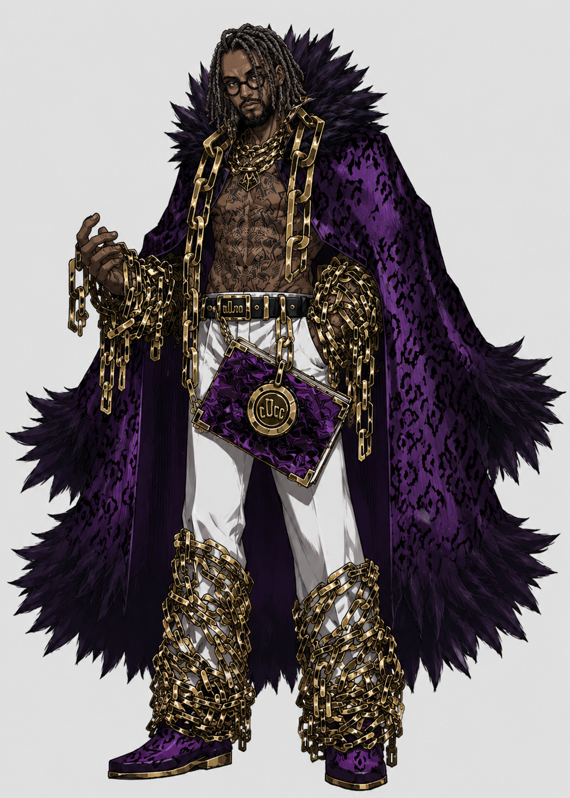

# Limbus PT-BR — Miojo 🍜

> Tradução PT-BR de **Limbus Company**, servida quente em 3 minutos.

A Cidade é o maior lugar habitável que restou no planeta, abrigando a maior parte da
população da Terra. Um lugar caótico onde a luta pela sobrevivência é o habitual e cada
dia vivo é uma bênção. A Cidade é dividida em **26 Distritos**, e cada Distrito é
controlado por uma **Wing** — megacorporações de tecnologia absurdamente avançada,
nomeadas de A a Z, donas das chamadas *Singularidades*, capazes de mudar drasticamente
o modo de vida na Cidade.

A tradução da comunidade **CLT District** é exatamente isso: uma **Asa**. Estrutura,
recursos, singularidade própria, funcionário de crachá. Respeite a Asa. 🫡

Nós? Nós somos **O Médio**. 🖕

Os **Dedos** — também conhecidos como **A Mão** — são o poder absoluto dos Sindicatos,
a única organização que mantém a "ordem" nas Backstreets. Nem as Wings nem a The Head
conseguem se meter facilmente nos negócios deles. São cinco: **Polegar, Indicador,
Médio, Anelar e Mindinho**, cada um com seu território, suas regras rigorosas e
punições implacáveis. E, como toda boa família criminosa, os Dedos vivem se estranhando
por território e negócios — de tempos em tempos se reúnem no **"Badalar dos Dedos"**
para fingir que se entendem e decidir como controlar as Backstreets. Cada Dedo ainda
tem seus **Subsidiários**, que ajudam a administrar os becos e a tocar os negócios dos
Sindicatos.

Pois bem: a CLT cuida do Distrito dela lá do arranha-céu. **A gente cuida do beco.**
O que a Asa ainda não traduziu — os Cantos novos, os Intervallos quentinhos saídos do
update, as falas que ficaram em inglês — chega primeiro aqui embaixo, contrabandeado
direto do coreano, com selo de qualidade d'O Médio. Subsidiário não oficial, preço de
beco, entrega no mesmo dia.

## ⚠️ AVISO D'O MÉDIO: NÃO PULE A HISTÓRIA

A gente traduziu **cada fala** desse jogo na mão, direto do coreano. Cada poema do Kim
do Chapéu de Bambu, cada "Mentor." da Aeng-du, cada surto da Dona Distorcida. Se você
instalar isso tudo e sair **segurando o botão de skip igual o Messias**, O Médio vai
saber. O Médio sempre sabe. E a punição dos Dedos, como manda a tradição, é
implacável.

|  |
|:--:|
| *Retrato falado do **Messias**, foragido das Backstreets: skipou 9 Cantos, 2 Intervallos e uma Noite de Walpurgis. Se vir este homem, não venda E.G.O pra ele. Denuncie ao Badalar dos Dedos.* |

## 📦 O que tem no pacote

- **TUDO da história** (`StoryData/`): Cantos I–IX completos, Arco E inteiro (219
  arquivos), Intervallos — incluindo o mais recente, **o Intervallo do Kim do Chapéu de
  Bambu** (update de 10–11/06), com as histórias das Identidades novas (Hong Lu
  S Corp., Ishmael LCD, Meursault).
- **Combate, eventos e UI** do conteúdo novo: skills, buffs, presentes E.G.O da
  Masmorra Espelho, announcer do Kim & Aeng-du, vozes, tutoriais, banners.
- Tudo traduzido **a partir do coreano oficial**, mantendo estilo e terminologia da
  base CLT (a Asa fixa o glossário; O Médio não quebra contrato… esse tipo de
  contrato, pelo menos).
- A base **ptbr-CLT completa** já vem dentro do zip — fonte, config, tudo. Não precisa
  instalar nada antes.

## 🔧 Como instalar (do jeito que até o Messias consegue)

Muita gente relatou problema instalando por partes. Acabou. Agora o zip traz a pasta
`Lang` **inteira e pronta**, com a tradução já selecionada:

1. **Feche o jogo.**
2. Baixe o `Lang-ptbr-CLT-vX.Y.Z.zip` na
   [página de Releases](https://github.com/sostenesfreitas/limbus-pt-br-miojo/releases).
3. Extraia o zip. Vai sair uma pasta chamada `Lang`.
4. Jogue essa pasta `Lang` dentro de:

   ```
   C:\Program Files (x86)\Steam\steamapps\common\Limbus Company\LimbusCompany_Data\
   ```

   (clique com o direito no jogo na Steam → **Gerenciar → Procurar arquivos locais**
   se não souber onde é)
5. Se o Windows perguntar se quer **substituir os arquivos**: sim, substitui. Confia.
6. Abra o jogo. Se a tradução não vier sozinha, selecione **ptbr-CLT** nas opções de
   idioma. Pronto. Agora **leia a história** (vide aviso acima).

> 💡 O zip já inclui o `config.json` que deixa a ptbr-CLT selecionada — na maioria dos
> casos o jogo já abre em português.

## 🛠️ Pra quem gosta de fuçar (Subsidiários)

```
translations/          A tradução pronta (espelha Lang/ptbr-CLT/)
scripts/
  GLOSSARY.md          Glossário de termos (consistência com a Asa)
  INTERVALLO-BRIEF.md  Brief de tradução do Intervallo atual
  build-story.mjs      Reconstrói um arquivo de história a partir da base CLT
  apply-to-game.mjs    Instala translations/ na pasta do jogo (faz backup .bak)
```

Com [Node.js](https://nodejs.org) instalado e o jogo no caminho padrão da Steam:

```
node scripts/apply-to-game.mjs
```

## 🙏 Créditos

- **ptbr-CLT (CLT District)** — a Asa. Base, fonte, estilo e glossário. O Médio agradece
  e não morde a mão (é literalmente um dedo dela).
- **Project Moon** — *Limbus Company* © Project Moon. A gente só ama (e sofre com) o
  jogo de vocês.
- **O Médio** — tradução dos becos, direto do coreano, sem singularidade, na base do
  miojo e da teimosia.

*Cada dia vivo é uma bênção. Cada Canto lido, também.*
